<div align="center">

# ArchFlow

**Design a backend. Load it with traffic. Watch it break — then fix it.**

A visual distributed-systems simulator for learning system design: draw an architecture, push simulated traffic through it, and watch request flow, latency, queue buildup, failures, and bottlenecks play out live.

**[▶ Try it live → archflow-sim.vercel.app](https://archflow-sim.vercel.app)**

[](https://github.com/Lal-Jr/ArchFlow/actions/workflows/ci.yml)


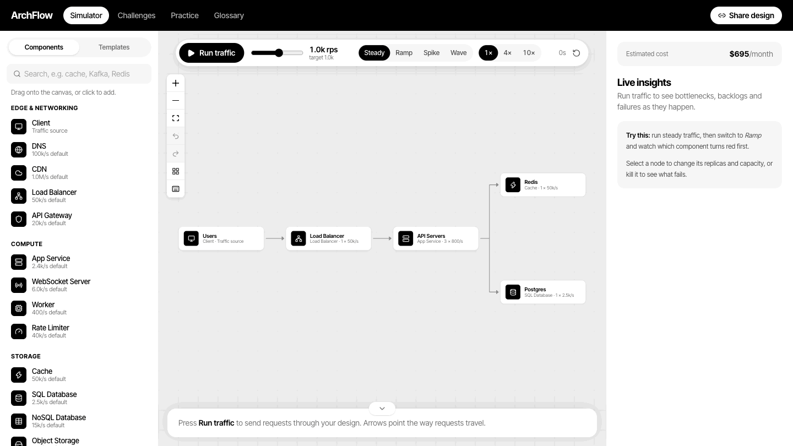

<sub>Traffic ramps up until the API servers overload (red). Two more replicas later, errors drop to 0% and latency recovers.</sub>

</div>

---

## At a glance

| | |
|---|---|
| **What it is** | An interactive whiteboard that simulates how a distributed system behaves under load — like a flight simulator for backend architecture. |
| **Who it's for** | Engineers preparing for system design interviews, students learning distributed systems, and anyone who wants to *see* why caches, queues, and replicas matter. |
| **What it shows** | Throughput, average and p99 latency, error rate, queue depth and estimated monthly cost — per component and for the whole system — updating 10 times a second. |
| **How it's built** | Next.js + React + TypeScript, React Flow for the canvas, and a custom rate-based simulation engine written from scratch (no simulation libraries), covered by 76 tests. Runs entirely in the browser. |

---

## See it in action

### 1. Build a system in seconds
Drag components onto the canvas, connect them, and press **Run traffic** (or hit `Space`). Requests flow in the direction of the arrows.

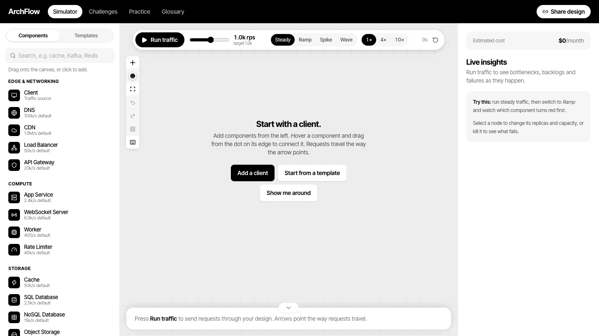

### 2. Watch a failure cascade
The news-feed reference design under a 5× traffic spike. Each post fans out to 200 follower feeds, so the feed cache is hit with 82k writes/s. It overloads, and the feed reads that depend on it start failing. The event stream buffers the burst while the workers fall behind.

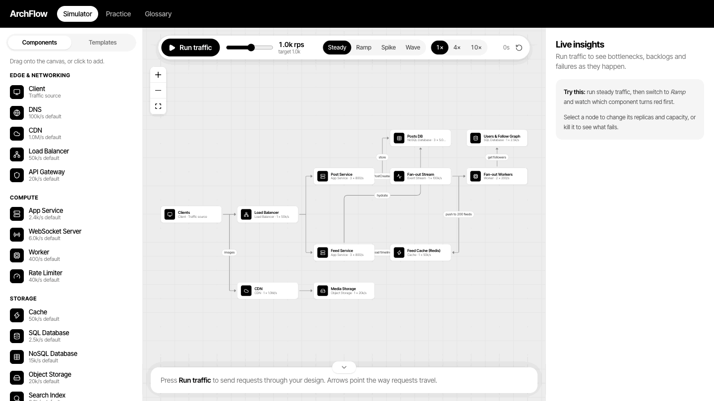

### 3. Make it resilient
Autoscaling adds replicas (after a realistic provisioning delay), retries amplify load on a struggling dependency, and a circuit breaker fails fast so it can recover. Below, Postgres has been killed: the breaker opens, latency stays at 25ms instead of piling up 1-second timeouts, and the autoscaler is adding a seventh API replica.

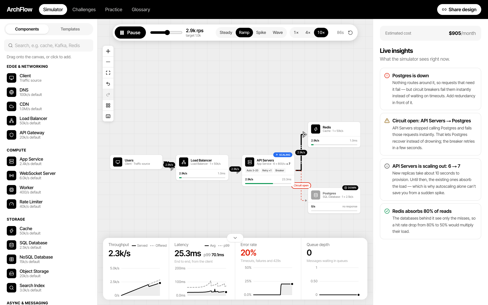

### 4. Beat a challenge
Four incidents with fixed traffic and hard goals: error rate, worst p99 latency and a monthly budget. Component specs are locked, so you win with architecture, not bigger numbers.

<table>
  <tr>
    <td width="50%">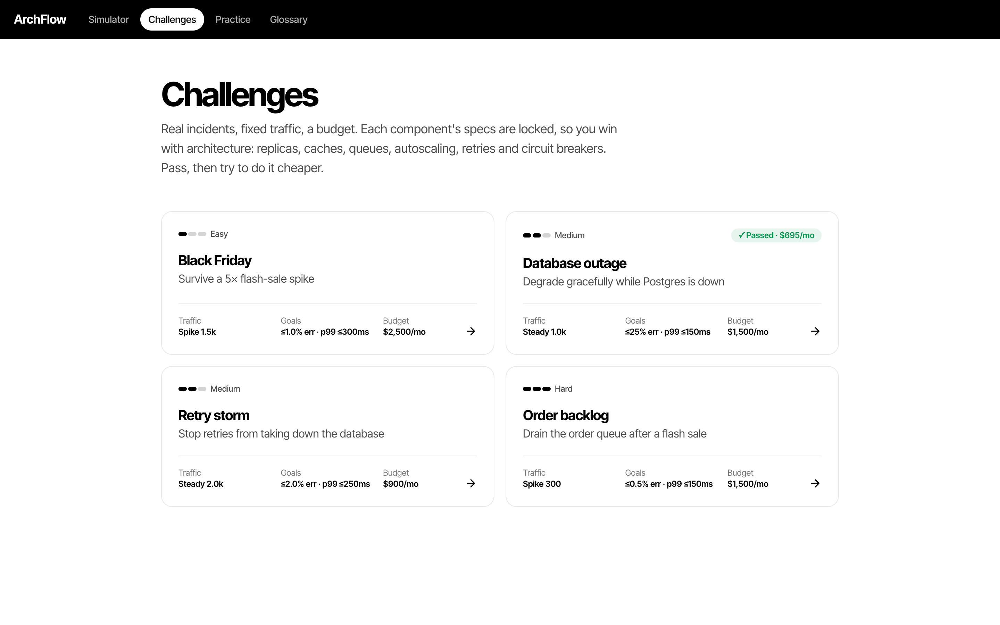<br /><sub><b>Challenges</b> — Black Friday, Database outage, Retry storm and Order backlog.</sub></td>
    <td width="50%">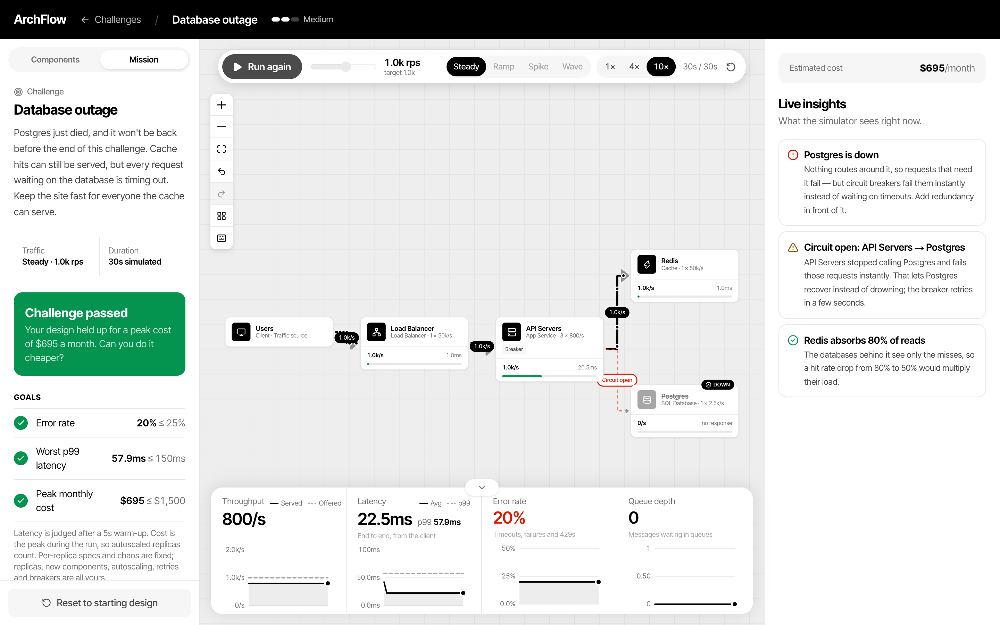<br /><sub><b>Passed</b> — a circuit breaker keeps p99 at 58ms while Postgres is down, at $695/month.</sub></td>
  </tr>
</table>

### More screenshots

<table>
  <tr>
    <td width="50%">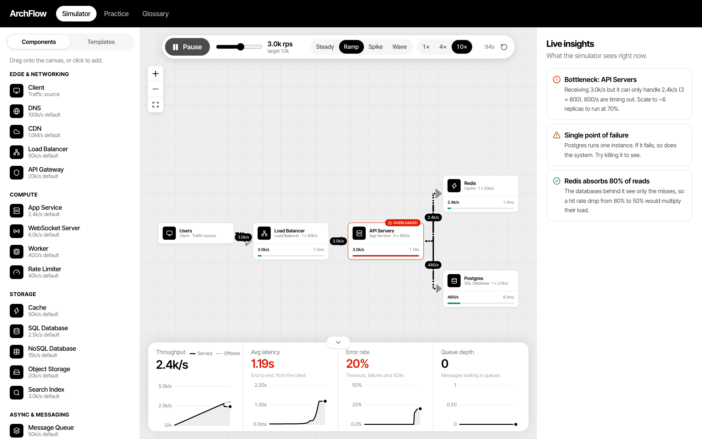<br /><sub><b>Live simulation</b> — the API servers are the bottleneck, and the insights panel says how many replicas fix it.</sub></td>
    <td width="50%">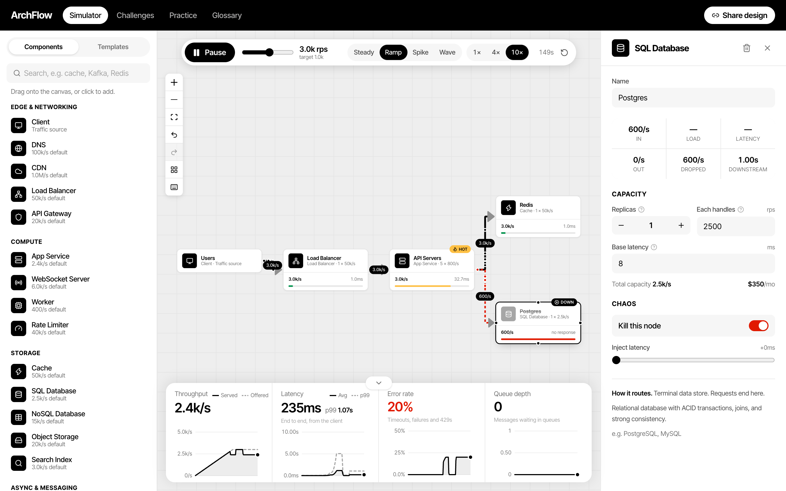<br /><sub><b>Chaos engineering</b> — kill Postgres and only cache misses fail (20% errors).</sub></td>
  </tr>
  <tr>
    <td width="50%">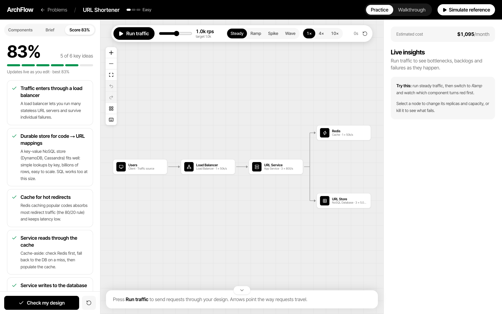<br /><sub><b>Interview practice</b> — your design is graded against the key ideas, with hints before answers.</sub></td>
    <td width="50%">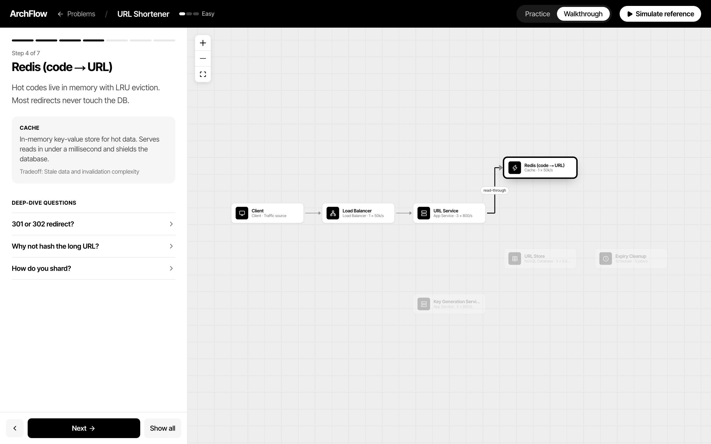<br /><sub><b>Walkthrough</b> — the reference architecture, built up one component at a time.</sub></td>
  </tr>
  <tr>
    <td width="50%">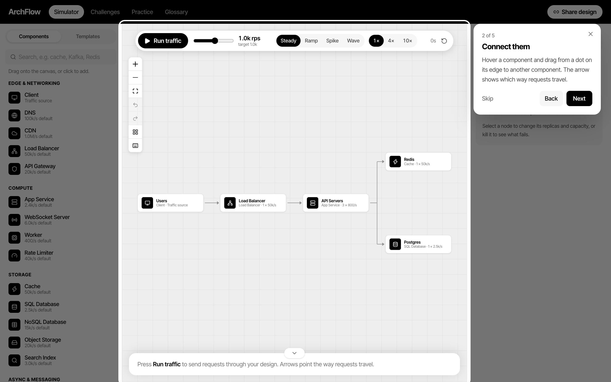<br /><sub><b>Guided tour</b> — first-time visitors get a five-step walkthrough of the editor.</sub></td>
    <td width="50%">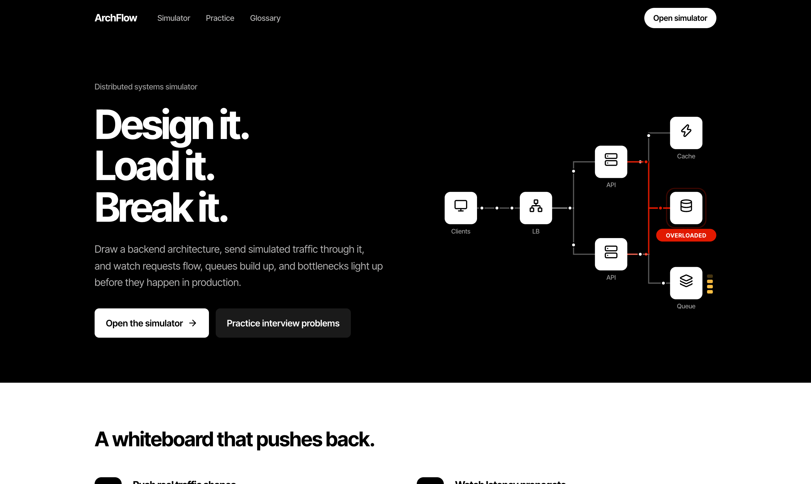<br /><sub><b>Home</b> — design it, load it, break it.</sub></td>
  </tr>
</table>

---

## Quick start

The fastest way is the live site: **[archflow-sim.vercel.app](https://archflow-sim.vercel.app)**. To run it locally, you need **Node.js 20.9 or newer** ([download](https://nodejs.org)).

```bash
git clone https://github.com/Lal-Jr/ArchFlow.git
cd ArchFlow
npm install
npm run dev
```

Open **http://localhost:3000** and click **Open the simulator**. A short guided tour shows you around. No accounts, no backend, no API keys — your designs are saved in your browser.

Other scripts: `npm test` (unit tests), `npm run lint`, `npm run typecheck`, `npm run build`.

---

## How to use it

### The simulator (`/sandbox`)

1. **Pick a starting point.** Open the **Templates** tab and load *Three-tier web app*, or any of the six interview reference designs. Or start from a blank canvas.
2. **Run traffic.** Press **Run traffic** (or `Space`). Dots flow along each connection, and the label shows requests per second.
3. **Turn up the load.** Drag the traffic slider (10 – 50,000 rps) or choose a pattern:

   | Pattern | What it does | Use it to… |
   |---|---|---|
   | **Steady** | Constant load at the target rate | Check a design is healthy at expected traffic |
   | **Ramp** | Climbs from 0 to 3× the target over 90s | Find the first component to break |
   | **Spike** | 5× bursts for 8s every 40s | See how queues absorb bursts (and what doesn't) |
   | **Wave** | Rises and falls ±60%, like daily traffic | Watch headroom shrink at peak |

   Use **1× / 4× / 10×** to speed up simulated time.
4. **Read the results.**
   - **Nodes** show incoming rps, a load bar, and latency, with badges for **Hot**, **Overloaded**, **Down** and **Scaling**.
   - **Connections** get thicker with traffic, turn red when they lead into trouble, and show retry multipliers or **Circuit open**.
   - **The bottom panel** charts throughput, average and p99 latency, error rate, and queue depth. Hover to compare the same moment across all four.
   - **The right panel** shows the estimated monthly cost and live insights in plain English. Click an insight to jump to that component.
5. **Fix it.** Click a component to change **replicas**, **capacity**, **latency**, cache **hit rate**, or a rate limiter's limit. Hover the ? icons for what each setting means.
6. **Make it resilient.** Turn on **autoscaling** (with a maximum), **retries**, or a **circuit breaker** on any service.
7. **Break it.** In **Chaos**, kill a node or inject latency.
8. **Share it.** **Share design** copies a link that contains the whole design. Anyone who opens it sees your exact setup (their own sandbox is backed up first).

### Keyboard shortcuts

| Keys | Action |
|---|---|
| `Space` | Run / pause traffic |
| `R` | Reset the simulation |
| `⌘/Ctrl Z` · `⌘/Ctrl ⇧ Z` | Undo · redo |
| `⌘/Ctrl D` | Duplicate the selected component |
| `Delete` | Delete the selection |
| `F` | Fit the design to the screen |
| `L` | Tidy up the layout |
| `?` | Show all shortcuts (and replay the tour) |

**Canvas basics:** drag from the palette (or click) to add; hover a component and drag from a dot on its edge to connect; click a connection to set its **traffic weight** or **calls per request**, or to reverse it. The palette has a search box.

> **Direction matters.** An arrow from A to B means "A sends requests to B". If a component never lights up, check which way its arrows point — the insights panel flags components that get no traffic.

### Challenges (`/challenges`)

Each challenge fixes the traffic, the duration and the goals. Press **Start challenge**, watch the goals tick as it runs, then read the verdict. Stuck? Hints unlock one at a time. Every challenge has a test proving the starting design fails and the intended fix passes.

| Challenge | The situation | What it teaches |
|---|---|---|
| **Black Friday** | A 5× flash-sale spike | Autoscaling is too slow for short spikes — provision for the peak |
| **Database outage** | Postgres is down for good | Circuit breakers fail fast so one failure doesn't slow everyone |
| **Retry storm** | Retries swamp an under-provisioned DB | Caching beats buying more database |
| **Order backlog** | A queue floods faster than workers drain it | Size consumers for the burst; cap autoscaling to stay on budget |

### Interview practice

1. Choose a problem from the home page — URL Shortener, Rate Limiter, Chat App, News Feed, Video Streaming, or Ride Sharing.
2. Read the **Brief**: requirements and back-of-the-envelope numbers.
3. Draw your design, then click **Check my design** for a score and hints. The answer only appears if you click **Reveal answer**.
4. Run traffic on your own design to check it survives.
5. Switch to **Walkthrough** to step through the reference solution, or click **Simulate reference** to load it into the simulator.

The **Glossary** (`/learn`) covers all 17 components: what each one does, when to use it, its tradeoffs, and how the simulator models it.

### Optional: AI design review

ArchFlow can ask Claude to review a design like an interviewer would (score, risks, strengths, next steps). It's **off by default** and completely hidden unless you set a server-side key:

```bash
echo "ANTHROPIC_API_KEY=sk-ant-..." > .env.local
```

The key never reaches the browser. Requests are size-limited and rate-limited per server instance. Each review is billed to your key.

---

## How the simulation works

ArchFlow uses a **rate-based (fluid) model**: instead of simulating millions of individual requests, it tracks how many requests per second flow through each component, updating every 100ms of simulated time.

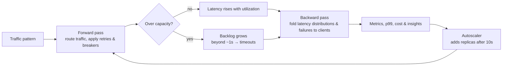

| Concept | How it's modeled |
|---|---|
| **Capacity** | Each component handles `replicas × capacity` requests/sec. Excess work waits in a backlog; after about a second, requests time out and count as errors. |
| **Queueing delay** | Latency grows with utilization along a "hockey stick" curve, plus time spent waiting in the backlog. |
| **Routing** | Load balancers split traffic by weight across healthy targets. Services call every dependency; with a cache beside a database, the database only sees misses. Rate limiters reject the excess with 429s. |
| **Queues** | Asynchronous: producers only wait for the enqueue, and consumers drain as fast as their capacity allows. |
| **Retries** | A caller retrying `r` times multiplies load on a dependency failing at rate `F` by `1 + F + … + Fʳ` — the feedback loop behind retry storms. |
| **Circuit breakers** | When a dependency fails more than 50% of calls, the caller stops calling it for 5 seconds and fails those requests instantly. |
| **Autoscaling** | Targets 60% utilization; new replicas take 10 seconds to provision, scale-in waits 30 seconds, within your min and max. |
| **Tail latency** | Each component's latency is a distribution (fixed work plus exponential queueing). Paths convolve and mix these, and p50/p95/p99 are read off the result. |
| **Failures** | A dead node fails every request after a 1-second timeout (or instantly behind an open breaker). Failure probability folds back to the clients. |
| **Cost** | Each replica has a rough monthly price, so scaling decisions have a visible cost. |

Defaults live in [`src/lib/sim/config.ts`](src/lib/sim/config.ts); the engine is [`src/lib/sim/engine.ts`](src/lib/sim/engine.ts) and the latency math is [`src/lib/sim/latency.ts`](src/lib/sim/latency.ts).

---

## Engineering highlights

- **Simulation engine written from scratch**, in pure TypeScript with no UI dependencies. Graphs are compiled once per edit (depth-first search drops cycles, Kahn's algorithm orders the rest); each tick is a forward pass for traffic and a backward pass that folds latency distributions and failure probabilities back to the clients.
- **Tested like a library.** 76 tests cover the engine (conservation of traffic, cache-aside, overload, failover, queues, retries, breakers, autoscaling, tail latency), every reference solution (passes its own grader and stays healthy at default load), every challenge (starting design fails, intended fix passes, and each hint's claim holds), share-link encoding and the layout algorithm. GitHub Actions runs lint, typecheck, tests and a build on every push.
- **Live updates without re-rendering the graph.** Metrics flow through a small external store read with `useSyncExternalStore`, so 10 updates a second never rebuild the React Flow graph.
- **Accurate in background tabs.** The loop advances by elapsed wall-clock time and catches up on throttled timers.
- **Shareable links with no backend.** Designs are packed, deflated with `CompressionStream`, base64url-encoded into the URL hash, and strictly validated on the way back in.
- **Undo/redo that feels right.** Settled edits become single steps (a whole drag is one undo), and an edit that hasn't settled yet is committed before undoing it.
- **Explainable output.** The insights engine turns metrics into specific advice, e.g. *"Scale to ~6 replicas to run at 70%."*
- **Deliberate design system.** High-contrast black and white; color only signals status, and every status also has an icon and a label.

### Project structure

```
src/
├── app/                   # Routes: home, /sandbox, /challenges, /problems/[slug], /learn, /api/review
├── components/
│   ├── editor/            # Canvas, live nodes & edges, inspector, charts, tour, shortcuts, undo, sim hook
│   ├── Sandbox.tsx        # Simulator page: templates and share links
│   ├── ChallengeWorkspace.tsx / ChallengePanel.tsx
│   └── Workspace.tsx      # Interview practice + walkthrough
└── lib/
    ├── sim/               # Engine, latency distributions, defaults & costs, traffic, insights
    ├── challenges.ts      # Challenge definitions and scoring
    ├── problems.ts        # Interview problems, grading checkpoints, reference solutions
    ├── share.ts           # Share-link encoding and validation
    ├── layout.ts          # "Tidy up" layered layout
    └── review.ts          # Optional AI review: request, schema, prompt
```

---

## Adding a problem or challenge

- **Problems** live in [`src/lib/problems.ts`](src/lib/problems.ts): `checkpoints` (what the grader looks for) and a `solution` (grid-placed nodes with optional simulation `config`, and edges with optional `ratio`). Node order is the walkthrough order.
- **Challenges** live in [`src/lib/challenges.ts`](src/lib/challenges.ts): traffic, duration, goals, a starting design, optional fixed `overrides`, and hints. Add a test in `challenges.test.ts` proving the start fails and your intended fix passes.

---

## Limitations & roadmap

- The model is rate-based: p99 is an estimate from latency distributions, not measured from individual requests.
- The layout is designed for **desktop** screens.
- Ideas: multi-region and replication-lag scenarios, more challenges, and exporting designs as images.
