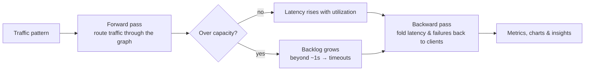

<div align="center">

# ArchFlow

**Design a backend. Load it with traffic. Watch it break — then fix it.**

A visual distributed-systems simulator for learning system design: draw an architecture, push simulated traffic through it, and watch request flow, latency, queue buildup, failures, and bottlenecks play out live.


<sub>Traffic ramps up until the API servers overload (red). Two more replicas later, errors drop to 0% and latency recovers.</sub>

</div>

---

## At a glance

| | |
|---|---|
| **What it is** | An interactive whiteboard that simulates how a distributed system behaves under load — like a flight simulator for backend architecture. |
| **Who it's for** | Engineers preparing for system design interviews, students learning distributed systems, and anyone who wants to *see* why caches, queues, and replicas matter. |
| **What it shows** | Throughput, end-to-end latency, error rate, and queue depth — per component and for the whole system — updating 10 times a second. |
| **How it's built** | Next.js + React + TypeScript, React Flow for the canvas, and a custom rate-based simulation engine written from scratch (no simulation libraries). Runs entirely in the browser. |

---

## See it in action

### 1. Build a system in seconds
Drag components onto the canvas, connect them, and press **Run traffic**. Requests flow in the direction of the arrows.


### 2. Watch a failure cascade
The news-feed reference design under a 5× traffic spike. Each post fans out to 200 follower feeds, so the feed cache is hit with 82k writes/s. It overloads, and the feed reads that depend on it start failing. The event stream buffers the burst while the workers fall behind.


### Screenshots

<table>
  <tr>
    <td width="50%"><br /><sub><b>Live simulation</b> — the API servers are the bottleneck, and the insights panel says how many replicas fix it.</sub></td>
    <td width="50%"><br /><sub><b>Chaos engineering</b> — kill Postgres and only cache misses fail (20% errors). Timeouts push latency up.</sub></td>
  </tr>
  <tr>
    <td width="50%"><br /><sub><b>Interview practice</b> — your design is graded against the key ideas, with hints before answers.</sub></td>
    <td width="50%"><br /><sub><b>Walkthrough</b> — the reference architecture, built up one component at a time with the reasoning behind each.</sub></td>
  </tr>
</table>


---

## Quick start

You need **Node.js 20.9 or newer** ([download](https://nodejs.org)).

```bash
git clone https://github.com/Lal-Jr/ArchFlow.git
cd ArchFlow
npm install
npm run dev
```

Open **http://localhost:3000** and click **Open the simulator**. That's it — no accounts, no backend, no API keys. Your designs are saved in your browser.

---

## How to use it

### The simulator (`/sandbox`)

1. **Pick a starting point.** Open the **Templates** tab and load *Three-tier web app*, or any of the six interview reference designs. Or start from a blank canvas.
2. **Run traffic.** Press **Run traffic** in the control bar at the top. Dots flow along each connection, and the label shows requests per second.
3. **Turn up the load.** Drag the traffic slider (10 – 50,000 rps) or choose a pattern:

   | Pattern | What it does | Use it to… |
   |---|---|---|
   | **Steady** | Constant load at the target rate | Check a design is healthy at expected traffic |
   | **Ramp** | Climbs from 0 to 3× the target over 90s | Find the first component to break |
   | **Spike** | 5× bursts for 8s every 40s | See how queues absorb bursts (and what doesn't) |
   | **Wave** | Rises and falls ±60%, like daily traffic | Watch headroom shrink at peak |

   Use **1× / 4× / 10×** to speed up simulated time.
4. **Read the results.**
   - **Nodes** show incoming rps, a load bar, and latency. A badge appears when a node is **Hot** (≥75%), **Overloaded**, or **Down**.
   - **Connections** get thicker and busier with traffic, and turn red when they lead into trouble.
   - **The bottom panel** charts throughput, average latency, error rate, and queue depth. Hover any chart to compare the same moment across all four.
   - **Live insights** (right panel) explains what's happening in plain English. Click an insight to jump to that component.
5. **Fix it.** Click a component to open the inspector. You can change **replicas**, **capacity per replica**, **base latency**, a cache's **hit rate**, or a rate limiter's limit. The simulation updates immediately.
6. **Break it.** In the inspector's **Chaos** section, **kill the node** or **inject latency**. Load balancers route around dead instances, and everything else fails or slows down as it would in a real system.

**Editing the canvas**

| Action | How |
|---|---|
| Add a component | Drag it from the **Components** tab, or click it |
| Connect two components | Hover a component, then drag from a dot on its edge to another component |
| Change how traffic splits | Click a connection. Set a **traffic weight** (for load balancers) or **calls per request** (e.g. `200` for fan-out to followers) |
| Reverse a connection | Click it → **Reverse direction** |
| Delete | Select, then press `Backspace` / `Delete`, or use the trash icon |
| Pan / zoom | Drag the background / scroll or pinch |

> **Direction matters.** An arrow from A to B means "A sends requests to B". If a component never lights up, check which way its arrows point. The insights panel flags components that get no traffic.

### Interview practice

1. Choose a problem from the home page — URL Shortener, Rate Limiter, Chat App, News Feed, Video Streaming, or Ride Sharing.
2. Read the **Brief**: requirements and back-of-the-envelope numbers.
3. Draw your design, then click **Check my design**. You'll get a score plus hints for anything missing. Hints come first; the answer only appears if you click **Reveal answer**.
4. Run traffic on your own design to check it survives.
5. Switch to **Walkthrough** to step through the reference solution (arrow keys work), or click **Simulate reference** to load it into the simulator.

The **Glossary** (`/learn`) covers all 17 components: what each one does, when to use it, its tradeoffs, and how the simulator models it.

---

## How the simulation works

ArchFlow uses a **rate-based (fluid) model**: instead of simulating millions of individual requests, it tracks how many requests per second flow through each component. It updates every 100ms of simulated time. The model is simple enough to reason about, but it still reproduces the failure modes that come up in real systems and in interviews.



| Concept | How it's modeled |
|---|---|
| **Capacity** | Each component handles `replicas × capacity` requests/sec. Excess work waits in a backlog. After about a second of backlog, requests time out and count as errors. |
| **Queueing delay** | Latency grows with utilization along a "hockey stick" curve (you barely notice it at 50%, and it climbs steeply past 80%), plus any time spent waiting in the backlog. |
| **Routing** | Load balancers split traffic by weight across *healthy* targets. Services call every dependency. With a cache next to a database, the database only sees cache misses. Caches forward their misses. Rate limiters reject the excess with 429s. |
| **Queues** | Asynchronous: producers only wait for the enqueue. Consumers pull as fast as their capacity allows, so the backlog grows whenever producers outpace them. |
| **Failures** | A dead node fails every request it receives, after a 1s timeout. Latency and failure probability are folded from the leaves back up to the clients, so a failing database shows up as errors at the user. |

Every component's defaults (capacity, latency, replicas) are in [`src/lib/sim/config.ts`](src/lib/sim/config.ts), and the engine is in [`src/lib/sim/engine.ts`](src/lib/sim/engine.ts).

---

## Engineering highlights

- **Simulation engine written from scratch.** It's pure TypeScript with no UI dependencies ([`engine.ts`](src/lib/sim/engine.ts)). Each graph is compiled once per edit: a depth-first search finds and ignores edges that form cycles, and Kahn's algorithm orders the rest. Every tick then does one forward pass (moving traffic) and one backward pass (folding latency and failure probability back to the clients).
- **Live updates without re-rendering the whole graph.** Metrics go into a small external store read through `useSyncExternalStore`. Each node and edge subscribes to its own numbers, so 10 updates a second never rebuild the React Flow graph, and dragging stays smooth while the simulation runs.
- **Accurate in background tabs.** Browsers throttle timers in background tabs. The simulation loop advances by elapsed wall-clock time and catches up on missed ticks, so simulated time stays correct.
- **Explainable output.** The insights engine ([`insights.ts`](src/lib/sim/insights.ts)) turns raw metrics into specific advice, e.g. *"Receiving 3.0k/s but can only handle 2.4k/s (3 × 800). Scale to ~6 replicas to run at 70%."*
- **Charts built by hand.** Small-multiple SVG line charts with hover crosshairs synced across all four panels. No chart library.
- **Deliberate design system.** High-contrast black and white, with color used only to signal status (green healthy, amber hot, red failing). Every status also has an icon and a text label, so it never relies on color alone.

### Project structure

```
src/
├── app/                   # Next.js routes: home, /sandbox, /problems/[slug], /learn
├── components/
│   ├── editor/            # Canvas, live nodes & animated edges, inspector, charts, sim hook
│   ├── Sandbox.tsx        # Simulator page with templates
│   └── Workspace.tsx      # Interview practice + walkthrough
└── lib/
    ├── sim/               # Simulation engine, component defaults, traffic patterns, insights
    ├── problems.ts        # Interview problems, grading checkpoints, reference solutions
    ├── catalog.ts         # Component glossary
    └── grader.ts          # Checks a design against a problem's key ideas
```

---

## Adding a problem

Problems live in [`src/lib/problems.ts`](src/lib/problems.ts). Each problem defines:

- **`checkpoints`**: what the grader looks for. Either a component type exists (`kind: "component"`, with an optional `min` count) or two types are connected (`kind: "connection"`, in either direction).
- **`solution`**: the reference design. Nodes are placed on a grid (`col` / `row`) and can override simulation `config`. Edges can set a `ratio`: calls per request, or traffic weight for load balancers. Node order is the walkthrough order.

---

## Limitations & roadmap

- Latency is an **average** across requests, not p99. Tail latency would need a distribution-based model.
- The layout is designed for **desktop** screens.
- Ideas: shareable design links, p95/p99 estimates, multi-region and replication-lag scenarios, and AI feedback on your design.
